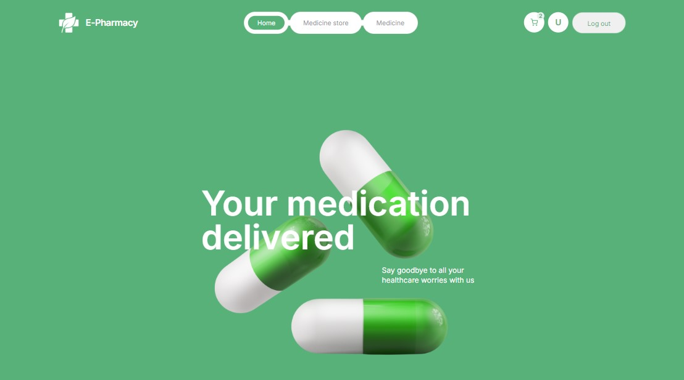

# 
E-Pharmacy

E-Pharmacy is a web application designed for purchasing medicines online, with a
strong emphasis on mobile-first design. The site is fully responsive, featuring
adaptive layouts at breakpoints of 375px, 768px, and 1440px. The application
includes modal windows for user authentication, such as signing in and signing
up.

The application is powered by its own backend API, which can be found here:
[E-Pharmacy Backend API](https://github.com/Tetiana85/E-Pharmacy-back)

The app offers full user authentication functionality, including registration,
login, fetching current user data, and logout.

The application consists of 7 main pages:

- Home page - /home | An overview page showcasing the application's features,
  nearby stores, and customer reviews.
- Register page - /register | A registration form implemented using Formik and
  Yup libraries.
- Login page - /login | A login form also built with Formik and Yup.
- Medicine store page - /medicine-store | Displays a list of pharmacies and
  their locations.
- Medicine page - /medicine | Lists all available medicines with filtering by
  category and a keyword search feature. Custom pagination is also included.
- Product page - /product | Provides detailed information about a specific
  medicine, including user reviews. Users can add items to their cart.
- Cart page - /cart | A private page accessible only to authenticated users,
  where they can review and order medicines.

## 🛠️ Tech Stack

- [React](https://reactjs.org/)
- [Redux Toolkit](https://redux-toolkit.js.org)
- [styled-components](https://styled-components.com)

Additionally, the following libraries were utilized: axios, formik, yup,
react-icons, react-toastify, react-responsive, and react-select.
